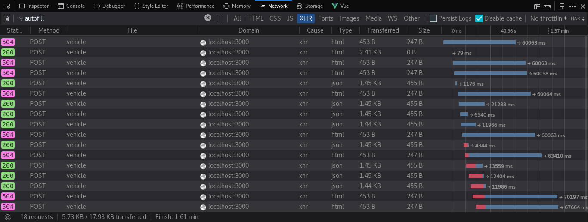
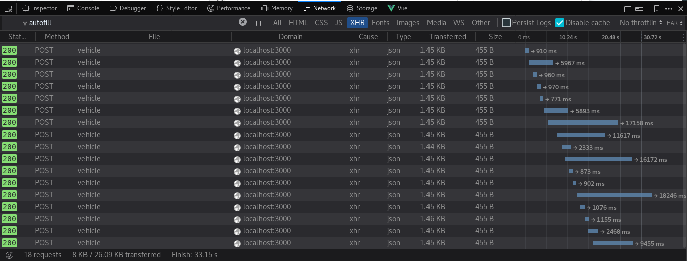

# Sinesp Cidadão PHP
<a href="LICENSE"></img></a>


[SINESP Cidadão][1] é uma base de dados pública de veículos e cidadões brasileiros muito útil para identificar carros ou motos roubados ou suspeitos, e de cidadões que possuem mandado de prisão.

# Sinesp PHP API Client

Infelizmente, o governo não mantém uma API pública para realizar esse tipo de consulta. Até então, a única maneira de visualizar as informações de um determinado veículo era através do site do Sinesp respondendo a perguntas de verificação (`captchas`) para cada uma das requisições. Assim, houve a necessidade de desenvolver uma API de modo a facilitar o acesso a essas informações.

# Informações Disponíveis

#### Se um `veículo` com a placa especificada for encontrado, o servidor irá retornar com as seguintes informações:

- *codigoRetorno*: código de retorno da consulta
- *mensagemRetorno*: mensagem de retorno da consulta
- *codigoSituacao*: código da situação do veículo
- *situacao*: mensagem da situação do veículo
- *modelo*: modelo do veículo
- *marca*: marca do veículo
- *cor*: cor do veículo
- *ano*: ano de fabricação do veículo
- *anoModelo*: ano do modelo do veículo
- *placa*: placa consultada
- *data*: data e hora da consulta
- *uf*: estado ou unidade federativa do veículo
- *municipio*: município ou cidade do veículo
- *chassi*: chassi do veículo
- *dataAtualizacaoCaracteristicasVeiculo*: data atualização das características do veículo
- *dataAtualizacaoRouboFurto*: data atualização de informações sobre roubo ou furto
- *dataAtualizacaoAlarme*:

#### Se um `mandado` com nome da pessoa especificada for encontrado, o servidor irá retornar com as seguintes informações:
- *codigoRetorno*: código de retorno da consulta
- *mensagemRetorno*: mensagem de retorno da consulta
- *idMandado*: id do mandado
- *numeroMandado*: numero do mandado
- *pessoa*: nome da pessoa
- *dataNascimento*: data de nascimento da pessoa
- *genitora*: nome da mãe da pessoa
- *RG*: RG da pessoa
- *CPF*: CPF da pessoa
- *tipoSituacaoMandado*: situação do mandado
- *tipoMandado*: tipo de mandado


Essas informações estarão disponíveis por meio de um `array associativo` ou como `atributo` do objeto.

# Requisitos

- PHP 5.4+
- cURL
- libxml / XML

# Instalação

Instale a versão mais recente com:

```sh
composer require breskott/sinesp
```

# Utilização

Abaixo um exemplo simples e geral de utilização da biblioteca:

```php
<?php
error_reporting(0);

require 'vendor/autoload.php';

use Sinesp\Sinesp;
use Sinesp\MandadoSinesp;

$veiculo = new Sinesp;
$mandado = new MandadoSinesp();

try {

    // Pega pelo Get
    $placa = $_GET['placa'];
    $nome = $_GET['nome'];

    if (!empty($placa)){
	    $veiculo->buscar($placa);

	    if ($veiculo->existe()) {
		    print_r($veiculo->dados());
	    }
    }

	if (!empty($nome)) {
		$mandado->buscar($nome);

		if ($mandado->existe()){
			print_r($mandado->dados());
		}
	}

} catch (\Exception $e) {
    echo $e->getMessage();
}
```

O método `buscar()` deve ser o primeiro método a ser invocado. Esse método é empregado para localizar informações do veiculo com a placa informada.

Após a chamada ao método `buscar()`, o método `dados()` irá retornar um array associativo contendo todas as informações do veículo ou cidadão.


## Proxy

O SINESP pode bloquear conexões vindas de fora do país.
Caso a consulta não retorne resultados por erro de conexão (por exemplo, erro de `timeout`), pode-se realizar uma consulta usando proxy.

Existem diversos proxy gratuitos (e.g., `http://proxylist.hidemyass.com/`) que podem ser encontrados facilmente na Internet. Um exemplo de utilização com proxy encontra-se abaixo:

```php
$veiculo = new Sinesp;
$mandado = new MandadoSinesp();

$veiculo->proxy('177.54.144.208', '80'); // Com proxy, esse metodo deve ser chamado antes do metodo buscar()
$mandado->proxy('177.54.144.208', '80'); // Com proxy, esse metodo deve ser chamado antes do metodo buscar()

$veiculo->buscar('GWW-6471');
$mandado->buscar('Nome da pessoa');

print_r($veiculo->dados());
print_r($mandado->dados());
```

Opcionalmente, ao invés de usar o metodo `proxy($ip, $porta)`, pode-se utilizar um array associativo com as chaves `ip` e `porta` como segundo argumento do método `buscar()`:

```php
$veiculo = new Sinesp;
$mandado = new MandadoSinesp();

$veiculo->buscar('GWW-6471', ['ip' => '177.54.144.208', 'porta' => '80']); // a consulta usara o proxy especificado
$mandado->buscar('Nome da Pessoa', ['ip' => '177.54.144.208', 'porta' => '80']); // a consulta usara o proxy especificado

print_r($veiculo->dados());
print_r($mandado->dados());
```

## Timeout
Uma vez que o SINESP não mata sua requisição após bloqueio, é provável que você acabe se deparando com erro(s) 504. A fim de evitar transtorno, foi disponibilizado o método `timeout` para definir um tempo máximo de resposta:

```php
$veiculo->timeout(5); // tempo em segundos
$mandado->timeout(5); // tempo em segundos
```

*Dica:* Em combinação com o [proxy](#proxy) (fazendo múltiplas tentativas com diferentes proxies), isso poderá aumentar consideravelmente suas chances de sucesso para múltiplas requisições


*Com diferentes proxies, mas sem timeout*


*Com diferentes proxies e timeout*

[1]: https://www.sinesp.gov.br/sinesp-cidadao "Sinesp Cidadão"
